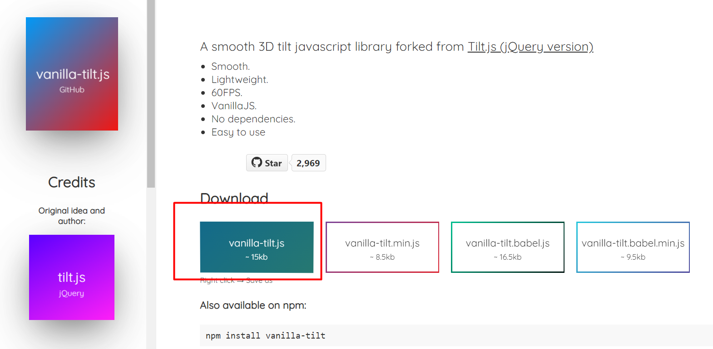
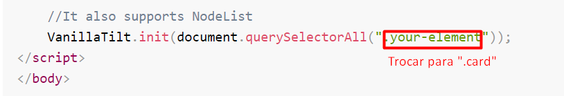
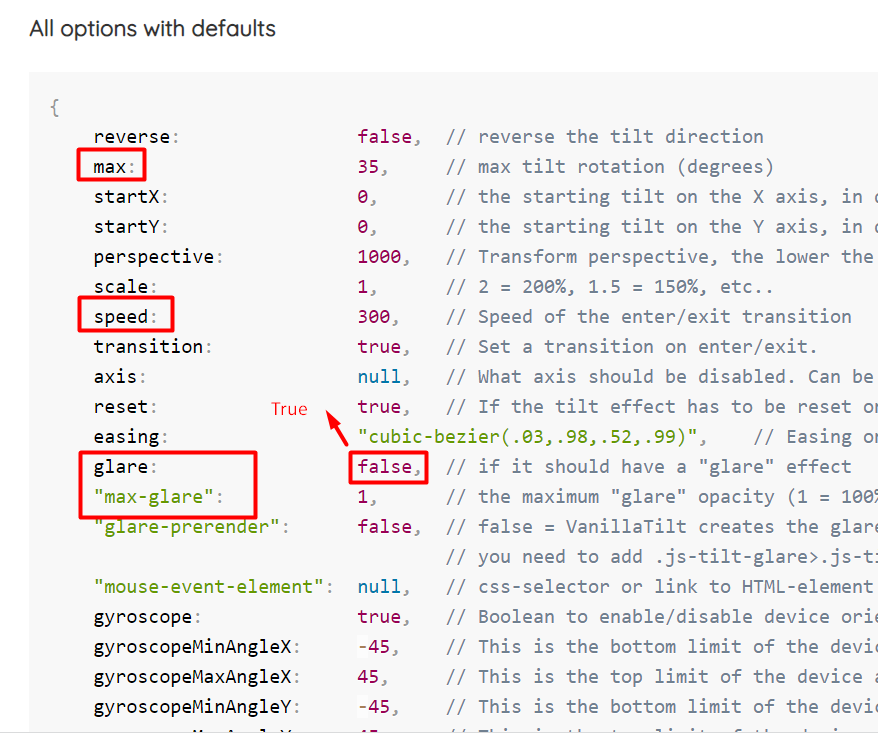

✔ Animação com card

- Nessa animação trabalhei com o display flex para ficar responsivo o card

- Animação com Vanilla JavaScript [https://micku7zu.github.io/vanilla-tilt.js]

    
    
    

## Tecnologias utilizadas 

  
  